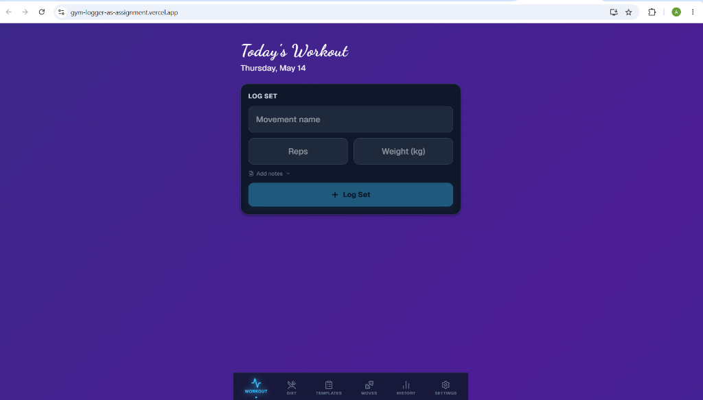

# Gym Logger AS



A modern, full-stack fitness and diet tracking application built with Next.js, Firebase, and Tailwind CSS.

## 🚀 Features

- **Authentication**: Secure user login and registration using Firebase Auth.
- **Gym Logging**: Track your movements, sets, reps, and weights.
- **Diet Tracking**: Monitor your daily nutrition and caloric intake with a dedicated Diet Form.
- **Responsive Design**: Clean and interactive UI built with Tailwind CSS and Lucide React icons.
- **Real-time Data**: Powered by Firebase Firestore for seamless data persistence.

## 🛠️ Tech Stack

- **Framework**: [Next.js](https://nextjs.org/) (App Router)
- **Language**: [TypeScript](https://www.typescriptlang.org/)
- **Styling**: [Tailwind CSS](https://tailwindcss.com/)
- **Backend/Auth**: [Firebase](https://firebase.google.com/)
- **Icons**: [Lucide React](https://lucide.dev/)

## 📦 Getting Started

### Prerequisites

- Node.js (Latest LTS version recommended)
- A Firebase project (for Firestore and Auth)

### Installation

1. **Clone the repository:**
   ```bash
   git clone https://github.com/alpamidha-prog/gym-logger-as-assignment.git
   cd gym-logger-as-assignment
   ```

2. **Navigate to the app directory:**
   ```bash
   cd gym-logger-app
   ```

3. **Install dependencies:**
   ```bash
   npm install
   ```

4. **Configure Environment Variables:**
   Create a `.env.local` file in the `gym-logger-app` directory and add your Firebase configuration:
   ```env
   NEXT_PUBLIC_FIREBASE_API_KEY=your_api_key
   NEXT_PUBLIC_FIREBASE_AUTH_DOMAIN=your_auth_domain
   NEXT_PUBLIC_FIREBASE_PROJECT_ID=your_project_id
   NEXT_PUBLIC_FIREBASE_STORAGE_BUCKET=your_storage_bucket
   NEXT_PUBLIC_FIREBASE_MESSAGING_SENDER_ID=your_messaging_sender_id
   NEXT_PUBLIC_FIREBASE_APP_ID=your_app_id
   ```

5. **Run the development server:**
   ```bash
   npm run dev
   ```
   Open [http://localhost:3000](http://localhost:3000) to see the application.

## 📁 Project Structure

- `gym-logger-app/src/app`: Next.js pages and layouts.
- `gym-logger-app/src/components`: Reusable UI components (e.g., DietForm, MovementTracker).
- `gym-logger-app/src/contexts`: React Contexts for global state (e.g., AuthContext).
- `gym-logger-app/src/lib`: Utility functions and service configurations (e.g., Firebase).

## 📄 License

This project is licensed under the MIT License.
